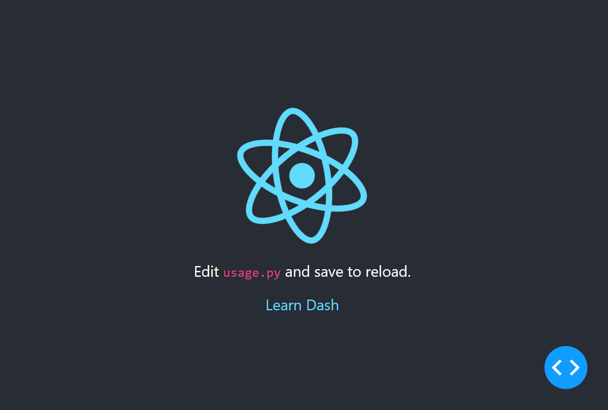

## dash-svg



Scalable Vector Graphics (SVG) library for [Plotly/Dash](https://dash.plotly.com/)

As with the Plotly/Dash [dash_html_components] library the SVG library components
are created automatically by scraping [SVG@developer.mozilla.org]. The resulting
Dash component library is a thin wrapper that accepts the SVG attributes and passes
them on to the underlying SVG engine in the browser.

Testing dash-svg is minimal, given the huge number of SVG components and
attribute combinations I suspect this will always be the case. Since the library is
generated automatically any bugs are likely to be systematic.

The [SVG@developer.mozilla.org] reference pages have been updated to SVG 2, the
dash-svg reflects these changes.

## Usage

Dash clone of the ubiquitous *create-react-app* default project,
```
import dash
from dash import html
from dash_svg import Svg, G, Path, Circle


app = dash.Dash(__name__)

app.layout = html.Div([
    html.Header([
        Svg([
            G([
                Path(d='...'),
                Circle(cx="420.9", cy="296.5", r='45.7'),
                Path(d='M520.5 78.1z')
            ], fill='#61DAFB')
        ], viewBox='0 0 841.9 595.3', className="App-logo", alt="logo"),
        html.P(["Edit ", html.Code("usage.py"), " and save to reload."]),
        html.A("Learn Dash", className="App-link", href="https://dash.plotly.com/",  target="_blank", rel="noopener noreferrer")
    ], className="App-header")
], className="App")


if __name__ == '__main__':
    app.run_server(debug=True)
```

To run demo:

    pip install dash-svg

    python usage.py


[dash_html_components]: https://github.com/plotly/dash/tree/dev/components/dash-html-components
[SVG@developer.mozilla.org]: https://developer.mozilla.org/en-US/docs/Web/SVG/Element
